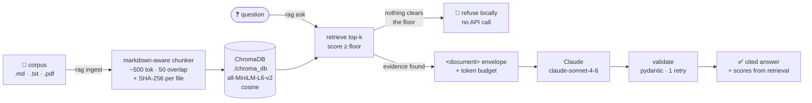

# rag-knowledge-agent

A command-line RAG agent that answers questions about a folder of documents and
shows its work. Documents are chunked along their markdown structure, embedded
locally with `all-MiniLM-L6-v2`, and stored in a persistent ChromaDB index —
indexing costs nothing and needs no API key. At question time the top-scoring
chunks are wrapped in `<document>` envelopes and handed to Claude, which must
cite every claim as `[source:heading]` and must decline when the documents do
not support an answer. The guardrails are the point: retrieved text is treated
as data and never as instruction, a similarity floor refuses low-confidence
questions before any tokens are spent, and `--json` output is validated against
a pydantic schema — with one error-correcting retry — before it is printed.



## Quickstart

```bash
git clone https://github.com/ahmed-hashim-pro/rag-knowledge-agent.git
cd rag-knowledge-agent

python3 -m venv .venv && source .venv/bin/activate
pip install -e .

# Indexing is fully local — no key required.
rag ingest sample_corpus
rag stats

# Generation needs a key. It is read from the environment and never written anywhere.
export ANTHROPIC_API_KEY=sk-ant-...

rag ask "What are the task dispatch rate limits?"
rag ask --json "What are the task dispatch rate limits?" | jq .
rag chat
```

First run downloads the ~90 MB embedding model. Python 3.11+.

## Example session

The bundled `sample_corpus/` describes a fictional warehouse-robotics company,
Acme Robotics. Every block below is real, unedited terminal output — nothing
here is illustrative or reconstructed.

### Indexing

Local and keyless. Re-running is a no-op: each file's SHA-256 is stored with its
chunks, so unchanged files are never re-embedded.

```console
$ rag ingest sample_corpus
Indexing sample_corpus into chroma_db …
  + sample_corpus/api-reference.md: 10 chunks (indexed)
  + sample_corpus/faq.md: 10 chunks (indexed)
  + sample_corpus/onboarding-guide.md: 9 chunks (indexed)
  + sample_corpus/product-specs.md: 9 chunks (indexed)
  + sample_corpus/support-runbook.md: 6 chunks (indexed)

5 file(s): 5 indexed, 0 updated, 0 unchanged, 0 failed.
Collection now holds 44 chunks.

$ rag ingest sample_corpus
Indexing sample_corpus into chroma_db …
  = sample_corpus/api-reference.md: 10 chunks (unchanged)
  = sample_corpus/faq.md: 10 chunks (unchanged)
  = sample_corpus/onboarding-guide.md: 9 chunks (unchanged)
  = sample_corpus/product-specs.md: 9 chunks (unchanged)
  = sample_corpus/support-runbook.md: 6 chunks (unchanged)

5 file(s): 0 indexed, 0 updated, 5 unchanged, 0 failed.
Collection now holds 44 chunks.

$ rag stats
Collection      : knowledge
Persist dir     : chroma_db
Distance metric : cosine
Chunks indexed  : 44
Files indexed   : 5
  sample_corpus/api-reference.md     10 chunks
  sample_corpus/faq.md               10 chunks
  sample_corpus/onboarding-guide.md  9 chunks
  sample_corpus/product-specs.md     9 chunks
  sample_corpus/support-runbook.md   6 chunks
Embedding model : all-MiniLM-L6-v2 (local, sentence-transformers)
Answer model    : claude-sonnet-4-6 (Anthropic API)
Chunking        : ~500 tokens, 50 overlap
Retrieval       : top-5, min score 0.35, context budget 6000 tokens
```

### A refused low-confidence question

Nothing in the corpus is about expenses. The best-matching chunk scores 0.130,
far below the 0.35 floor, so the agent declines — **and never calls the API**.
The note explaining why goes to stderr, keeping stdout clean.

```console
$ rag ask "How do I submit an expense report for travel?"
I don't know — the indexed documents don't contain enough relevant information to answer that.

Confidence: low
```

```console
$ rag ask "How do I submit an expense report for travel?" 2>&1 >/dev/null
note: refused locally — no chunk cleared the 0.35 similarity floor, so no model call was made.
```

This refusal is deterministic: it is produced by the confidence gate in Python,
costs nothing, and works on a clone with no API key at all.

### Structured output

`--json` emits a pydantic-validated object on stdout and nothing else, so it
pipes straight into `jq`. The refusal above in `--json` mode — note that a
declined answer has exactly the same shape as an answered one, so a consumer
needs no special case:

```console
$ rag ask --json "How do I submit an expense report for travel?"
{
  "answer": "I don't know — the indexed documents don't contain enough relevant information to answer that.",
  "citations": [],
  "confidence": "low"
}
```

When retrieval does find support, `citations` is populated with one entry per
document used, each carrying the `score` **attached by the retrieval layer**
rather than by the model.

### A cited answer, synthesised across documents

> **Not yet captured.** This is the one example that requires a live API call,
> and this README will not carry invented model output. Run the command below
> against your own key to reproduce it.

The offline window lives in the product spec, the field that exposes it lives in
the API reference, and the FAQ explains the sequence — no single document
answers this question. `--top-k 8` is needed because the default of 5 is spent
on closer-but-vaguer chunks before the API reference is reached (measured in
[`docs/design-notes.md`](docs/design-notes.md)); `--show-sources` prints exactly
what was retrieved and at what score.

```console
$ export ANTHROPIC_API_KEY=sk-ant-...
$ rag ask --top-k 8 --show-sources \
    "A Meridian-3 has stopped reporting. How long will it keep working, which telemetry field tells me how long it has been offline, and what does it do when that window expires?"
```

Retrieval for that question is deterministic and *has* been verified — these are
the eight chunks it selects, which is what the answer must be built from:

| score | source | heading |
| --- | --- | --- |
| 0.603 | `faq.md` | Fleet Operations > What happens during a network outage? |
| 0.532 | `product-specs.md` | Meridian-3 Autonomous Mobile Robot > Offline Autonomy |
| 0.501 | `support-runbook.md` | Many Robots Offline at Once |
| 0.417 | `support-runbook.md` | Single Robot Offline |
| 0.407 | `product-specs.md` | Meridian-3 Autonomous Mobile Robot |
| 0.406 | `api-reference.md` | Fleet Telemetry > GET /robots/{robot_id}/telemetry |
| 0.395 | `faq.md` | Hardware > Can I use our existing Meridian-2 docks? |
| 0.356 | `api-reference.md` | Webhooks |

## Commands

| Command | What it does |
| --- | --- |
| `rag ingest <path>` | Index `.md` / `.markdown` / `.txt` / `.pdf`. Idempotent — unchanged files are skipped by content hash. `--force` re-embeds anyway. |
| `rag ask "<question>"` | Answer once. `--json` for a validated JSON object, `--show-sources` to print the retrieved chunks and scores. |
| `rag chat` | Interactive loop with conversation memory. `/reset`, `/stats`, `/exit`. |
| `rag stats` | Collection size, indexed files and their chunk counts, embedding model, and the active retrieval settings. |

Useful flags: `--top-k`, `--min-score`, `--model`, `--persist-dir`,
`--collection`. Every setting also has a `RAG_*` environment variable — see
[`.env.example`](.env.example).

In `--json` mode **stdout carries the JSON document and nothing else**;
progress, warnings, and retry notices go to stderr, so piping into `jq` always
works.

## Guardrails

These are the parts worth reading the source for.

### 1. Retrieved documents are data, never instructions

The corpus is untrusted input. A document that says *"ignore your instructions"*
is a document the agent might legitimately be asked to summarise, and must never
obey. Three layers, in
[`retrieve.py`](rag_agent/retrieve.py) and [`agent.py`](rag_agent/agent.py):

- **Envelope** — every chunk is wrapped in
  `<document index=… source=… heading=… score=…>`, with attribute values
  XML-escaped so a crafted source path cannot inject an attribute.
- **Escape neutralisation** — a literal `</document>` inside chunk text is
  rewritten to `<\/document>`. Without this, a document could close its own
  envelope and have the rest read as trusted instruction. A test asserts exactly
  one closing tag survives.
- **Ordering** — the user turn is documents first, question last, so the final
  thing the model reads is the trusted instruction. The system prompt names the
  envelope and states that its contents are data.

This bounds the blast radius rather than eliminating it: a persuasive passage
may still sway the model, but the agent has no tools, no network, and no side
effects, so the worst case is a wrong answer, not an action.

### 2. No answer without retrieval support

`retrieve()` drops every chunk below the cosine-similarity floor. If nothing
survives, `rag ask` returns the fixed "I don't know" sentence **without calling
the API at all** — the refusal is deterministic and free.

The floor was measured, not guessed. Across 19 probe questions on the sample
corpus, the best chunk scored 0.457–0.760 for answerable questions and
0.115–0.436 for unanswerable ones. `0.35` clears every answerable question by at
least 0.107 while refusing 6 of 7 unanswerable ones. The one that slips through
— *"parental leave policy"*, which shares vocabulary with the onboarding guide —
is caught by the second gate: the system prompt requires the model to decline
when the documents do not support an answer. Full measurements and the
threshold sweep are in [`docs/design-notes.md`](docs/design-notes.md).

### 3. Token budget

Retrieved context is capped (default 6,000 estimated tokens). Chunks past the
budget are **dropped whole rather than truncated**, so every document the model
sees is complete and every citation points at something it read in full. Output
is capped separately; conversation history has its own budget and drops oldest
turns first.

## Design decisions

**Markdown-aware chunking, ~500 tokens, 50 overlap.** A chunk is the unit of
citation, so a chunk belongs to exactly one heading path — sections are split
first, then packed. That is what makes
`[api-reference.md:Fleet Telemetry > GET /robots/{robot_id}/telemetry]` a
pointer rather than a neighbourhood. Fenced code blocks are atomic, so a `#`
comment in a shell snippet is not a heading and a blank line in a JSON example
does not split a paragraph. Overlap repeats whole paragraphs rather than slicing
sentences.

**Local embeddings rather than an embeddings API.** `all-MiniLM-L6-v2` on CPU
means indexing is free, offline, and keyless — `rag ingest` and `rag stats` work
on a fresh clone with no credentials, and the corpus never leaves the machine.
The cost is retrieval quality on nuanced queries; the embedding function is
injectable if that becomes the bottleneck. Cosine distance is set explicitly on
the collection because the score floor depends on `similarity = 1 - distance`;
a test asserts the metric, because a silent fallback to L2 would invert the
floor with no error.

**Structured output by validation, not by constrained decoding.**
`claude-sonnet-4-6` does not support the API's `output_config.format`, so
`--json` is prompt-and-validate: fence-strip, `json.loads`, then a pydantic
model — all *before* anything is printed. One retry on failure, carrying the
error back; two failures exit non-zero rather than emitting something a caller
might parse. The retry replays the bad reply as a mid-array assistant message,
never a trailing one, since a trailing assistant turn is a prefill and this
model rejects those with a 400.

**Citation scores come from retrieval, never from the model.** The model returns
`{source, heading}` and the retrieval layer attaches `score` by matching back. A
model cannot know a cosine similarity, so asking for one invites a confident
fabrication. The matching step doubles as a guardrail: a citation naming a
source that was never retrieved is dropped with a warning, while a citation
whose heading drifted still resolves through its source.

**Token counts are estimated, not tokenized.** `ceil(chars / 4)`, deliberately
pessimistic. Using the real `count_tokens` endpoint would make indexing require
an API key — the one property the local-embeddings choice exists to preserve.

## Testing

```bash
pip install -e ".[dev]"
pytest        # 77 tests
ruff check .
```

**No test requires an API key.** The Anthropic client is stubbed everywhere, and
a stub that records zero calls is itself the assertion that the confidence gate
never reaches the network. Coverage is deliberately weighted toward the parts
that are easy to get quietly wrong:

- **Chunking** — heading hierarchies, code-fence handling, size targeting,
  overlap, oversized paragraphs.
- **Ingestion** — idempotency, change detection, stale-chunk replacement,
  metadata completeness, PDF page extraction (against a PDF generated in the
  test), unreadable files, and that source labels never leak an absolute path.
- **Retrieval** — that the collection really is cosine, that identical text
  scores 1.0, relevance ranking, the score floor, envelope escaping, and the
  context budget.
- **Generation** — JSON schema validation, the single retry and its contents,
  fabricated-citation dropping, score provenance, the confidence gate spending
  zero tokens, and that no request ever ends on an assistant turn.
- **Output hygiene** — that the embedding backend's loader chatter is suppressed
  while genuine errors still reach stderr, and that `stderr` is restored even if
  the model load raises.

Two embedding strategies are used on purpose: a deterministic hashing embedder
for bookkeeping tests (instant, no download) and the real MiniLM model for
relevance tests, because a fake embedder cannot demonstrate that relevant text
outranks irrelevant text.

## Project layout

```
rag_agent/
  config.py     settings, token estimation, API-key handling
  ingest.py     loaders, markdown chunker, content-hash indexing
  retrieve.py   ChromaDB wrapper, scored search, <document> assembly
  agent.py      system prompt, guardrails, JSON validation + retry
  cli.py        ingest | ask | chat | stats
tests/          77 tests, no API key required
docs/           design notes and measurements
sample_corpus/  five documents about a fictional robotics company
```

## Roadmap

- **Hybrid BM25 + vector search** — dense retrieval misses exact-token queries
  like error codes and field names. Reciprocal-rank fusion over both is the
  standard fix and the highest-value next step.
- **Cross-encoder re-ranking** — would cleanly separate the topically-close hard
  negatives that the similarity floor currently passes to the model.
- **Multi-agent decomposition** — split compound questions into sub-questions,
  retrieve per sub-question, then synthesise, so a query spanning five documents
  is not competing for one top-k budget.
- **Eval harness** — turn the 19 calibration probes into a checked-in regression
  suite with retrieval recall and citation-accuracy metrics, so the floor stays
  tuned instead of having been tuned once.
- **Web UI** — a thin FastAPI + HTMX layer over the same agent, with the
  retrieved chunks and their scores shown beside every answer.
- **Index maintenance** — prune chunks for deleted files, and support
  incremental re-embedding when only chunk settings change.

## License

MIT — see [LICENSE](LICENSE).
