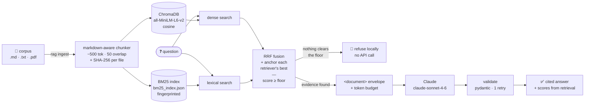

# rag-knowledge-agent

[](https://github.com/ahmed-hashim-pro/rag-knowledge-agent/actions/workflows/ci.yml) [](LICENSE)

A command-line RAG agent that answers questions about a folder of documents and
shows its work. Documents are chunked along their markdown structure, embedded
locally with `all-MiniLM-L6-v2`, and indexed twice — once as dense vectors in
ChromaDB and once as BM25 postings — so indexing costs nothing and needs no API
key. At question time both retrievers run and their rankings are fused, then the
top chunks are wrapped in `<document>` envelopes and handed to Claude, which must
cite every claim as `[source:heading]` and must decline when the documents do
not support an answer. The guardrails are the point: retrieved text is treated
as data and never as instruction, a similarity floor refuses low-confidence
questions before any tokens are spent, and `--json` output is validated against
a pydantic schema — with one error-correcting retry — before it is printed.



## Quickstart

```bash
git clone https://github.com/ahmed-hashim-pro/rag-knowledge-agent.git
cd rag-knowledge-agent

python3 -m venv .venv
source .venv/bin/activate        # Windows: .venv\Scripts\activate
pip install -e .                 # ~1.3 GB, a few minutes — see note below

# Indexing is fully local — no key required.
rag ingest sample_corpus
rag stats

# Generation needs a key. It is read from the environment and never written anywhere.
export ANTHROPIC_API_KEY=sk-ant-...

rag ask "What are the task dispatch rate limits?"
rag ask --json "What are the task dispatch rate limits?" | jq .
rag chat
```

**Before you start the install**, so nothing looks like it has hung: it pulls
about **1.3 GB** and takes a few minutes on a fast connection. Most of that is
`torch` (529 MB), which `sentence-transformers` requires to run the embedding
model locally — the trade for indexing that costs nothing and needs no API key.
The first command that embeds anything also downloads the 87 MB
`all-MiniLM-L6-v2` model from HuggingFace, so the first run needs network access
even though every run after it is offline.

Python 3.11+. Verified end to end on macOS (arm64, Python 3.12); the pinned
dependencies also resolve cleanly on 3.13 and 3.14.

## Example session

The bundled `sample_corpus/` describes a fictional warehouse-robotics company,
Acme Robotics. Every block below is real, unedited terminal output — nothing
here is illustrative or reconstructed.

### Indexing

Local and keyless. Re-running is a no-op: each file's SHA-256 is stored with its
chunks, so unchanged files are never re-embedded.

```console
$ rag ingest sample_corpus
Indexing sample_corpus into chroma_db …
  + sample_corpus/api-reference.md: 10 chunks (indexed)
  + sample_corpus/faq.md: 10 chunks (indexed)
  + sample_corpus/onboarding-guide.md: 9 chunks (indexed)
  + sample_corpus/product-specs.md: 9 chunks (indexed)
  + sample_corpus/support-runbook.md: 6 chunks (indexed)

5 file(s): 5 indexed, 0 updated, 0 unchanged, 0 failed.
Collection now holds 44 chunks.

$ rag ingest sample_corpus
Indexing sample_corpus into chroma_db …
  = sample_corpus/api-reference.md: 10 chunks (unchanged)
  = sample_corpus/faq.md: 10 chunks (unchanged)
  = sample_corpus/onboarding-guide.md: 9 chunks (unchanged)
  = sample_corpus/product-specs.md: 9 chunks (unchanged)
  = sample_corpus/support-runbook.md: 6 chunks (unchanged)

5 file(s): 0 indexed, 0 updated, 5 unchanged, 0 failed.
Collection now holds 44 chunks.

$ rag stats
Collection      : knowledge
Persist dir     : chroma_db
Distance metric : cosine
Chunks indexed  : 44
Files indexed   : 5
  sample_corpus/api-reference.md     10 chunks
  sample_corpus/faq.md               10 chunks
  sample_corpus/onboarding-guide.md  9 chunks
  sample_corpus/product-specs.md     9 chunks
  sample_corpus/support-runbook.md   6 chunks
Embedding model : all-MiniLM-L6-v2 (local, sentence-transformers)
Answer model    : claude-sonnet-4-6 (Anthropic API)
Chunking        : ~500 tokens, 50 overlap
Retrieval       : hybrid, top-5, min score 0.35, context budget 6000 tokens
Lexical index   : BM25 over 44 chunks, 775 terms (k1=1.5, b=0.75)
```

### A refused low-confidence question

Nothing in the corpus is about expenses. The best-supported chunk scores 0.271
under hybrid retrieval — 0.130 under `--retrieval vector` — so nothing clears
the 0.35 floor and the agent declines **without ever calling the API**. The note
explaining why goes to stderr, keeping stdout clean.

That gap between 0.130 and 0.271 is the honest cost of adding BM25: lexical
matching hands out partial credit for ordinary shared words, so unanswerable
questions sit closer to the floor than they used to. It is measured and tracked
rather than assumed away — see
[`docs/design-notes.md`](docs/design-notes.md#what-it-costs).

```console
$ rag ask "How do I submit an expense report for travel?"
I don't know — the indexed documents don't contain enough relevant information to answer that.

Confidence: low
```

```console
$ rag ask "How do I submit an expense report for travel?" 2>&1 >/dev/null
note: refused locally — no chunk cleared the 0.35 similarity floor, so no model call was made.
```

This refusal is deterministic: it is produced by the confidence gate in Python,
costs nothing, and works on a clone with no API key at all.

### Structured output

`--json` emits a pydantic-validated object on stdout and nothing else, so it
pipes straight into `jq`. The refusal above in `--json` mode — note that a
declined answer has exactly the same shape as an answered one, so a consumer
needs no special case:

```console
$ rag ask --json "How do I submit an expense report for travel?"
{
  "answer": "I don't know — the indexed documents don't contain enough relevant information to answer that.",
  "citations": [],
  "confidence": "low"
}
```

When retrieval does find support, `citations` is populated with one entry per
document used, each carrying the `score` **attached by the retrieval layer**
rather than by the model.

### A cited answer, synthesised across documents

The 12-minute window lives in the product spec, the field that exposes it lives
in the API reference, and the FAQ explains what happens on reconnect — no single
document answers this question.

Under pure vector search this needed `--top-k 8` before the API-reference chunk
appeared. Hybrid retrieval finds it at the **default** top-5, because BM25 ranks
it first on the literal token `offline_seconds` while the vector retriever has
it sixth:

Documents reaching the top-5 for this question, by mode (retrieval only, no
model call — reproduce with `python scripts/calibrate.py`):

| mode | documents retrieved |
| --- | --- |
| `vector` | faq, product-specs, support-runbook |
| `hybrid` | faq, product-specs, support-runbook, **api-reference** |

The full run, at default settings. `via=` shows which retrievers found each
chunk, `cos=` the cosine similarity, `bm25=` the raw lexical score:

```console
$ rag ask --show-sources \
    "A Meridian-3 has stopped reporting. How long will it keep working, which telemetry field tells me how long it has been offline, and what does it do when that window expires?"
Here is a complete answer drawn from the supplied documents:

**How long it keeps working**
A Meridian-3 continues executing its buffered task queue for up to **12 minutes** after losing its network link — this is the offline autonomy window, fixed in firmware and not configurable. [sample_corpus/product-specs.md:Acme Robotics — Product Specifications > Meridian-3 Autonomous Mobile Robot > Offline Autonomy]

**The telemetry field to watch**
The field `offline_seconds` counts up from the moment of the last successful report. Watch this value against the 12-minute window; when it crosses that threshold, a safe-park has almost certainly occurred. [sample_corpus/api-reference.md:Fleet Control API Reference > Fleet Telemetry > GET /robots/{robot_id}/telemetry]

**What happens when the window expires**
At the end of the 12-minute window — or sooner if the buffered queue is exhausted — the robot performs a **safe-park**: it finishes its current motion segment, pulls out of travel lanes to the nearest designated safe-park zone, sets its status beacon to **amber**, and holds position until the link is restored. It does not accept new tasks and does not attempt to return to a dock, because dock assignment requires Fleet Control. [sample_corpus/product-specs.md:Acme Robotics — Product Specifications > Meridian-3 Autonomous Mobile Robot > Offline Autonomy]

Once the link returns, the robot resumes on its own. You will receive a `robot.link_restored` event followed by a `robot.safe_parked` event, and the beacon will read amber until it is acknowledged. No manual intervention is required unless the beacon stays amber for more than a minute after reconnect. [sample_corpus/faq.md:Frequently Asked Questions > Fleet Operations > What happens during a network outage?]

Sources:
  - sample_corpus/faq.md:Frequently Asked Questions > Fleet Operations > What happens during a network outage?  (score 0.603)
  - sample_corpus/product-specs.md:Acme Robotics — Product Specifications > Meridian-3 Autonomous Mobile Robot > Offline Autonomy  (score 0.532)
  - sample_corpus/support-runbook.md:Support Runbook > Many Robots Offline at Once  (score 0.501)
  - sample_corpus/support-runbook.md:Support Runbook > Single Robot Offline  (score 0.427)
  - sample_corpus/api-reference.md:Fleet Control API Reference > Fleet Telemetry > GET /robots/{robot_id}/telemetry  (score 0.406)

Confidence: high

Retrieved context:
  [1] [sample_corpus/faq.md:Frequently Asked Questions > Fleet Operations > What happens during a network outage?]  score=0.603  via=vector+bm25  cos=0.603  bm25=9.09
      Meridian-3 robots keep working from their on-board task buffer for the duration of the offline autonomy window, then safe-park and wait. Nothing is lost: buffered tasks that completed while offline are reported to Fleet …
  [2] [sample_corpus/support-runbook.md:Support Runbook > Single Robot Offline]  score=0.427  via=vector+bm25  cos=0.417  bm25=5.97
      **Trigger:** one robot reports `link_state = offline` for more than two minutes. **Diagnosis.** Read its last telemetry. The two fields that matter are `position.zone` and `state_of_charge` at the last report. - If the z…
  [3] [sample_corpus/product-specs.md:Acme Robotics — Product Specifications > Meridian-3 Autonomous Mobile Robot > Offline Autonomy]  score=0.532  via=vector+bm25  cos=0.532  bm25=3.83
      Every Meridian-3 buffers its current task queue on board. If the robot loses its network link to Fleet Control it continues executing the buffered queue for up to **12 minutes**. This is the offline autonomy window. At t…
  [4] [sample_corpus/api-reference.md:Fleet Control API Reference > Fleet Telemetry > GET /robots/{robot_id}/telemetry]  score=0.406  via=vector+bm25  cos=0.406  bm25=4.93
      Returns the current state of one robot. This is the endpoint to poll when you need to know whether a robot is reachable. ```json { "robot_id": "mrd3-0041", "model": "meridian-3", "link_state": "offline", "offline_seconds…
  [5] [sample_corpus/support-runbook.md:Support Runbook > Many Robots Offline at Once]  score=0.501  via=vector+bm25  cos=0.501  bm25=3.42
      **Trigger:** more than 20 % of a fleet reports `link_state = offline` within a two-minute span. **Diagnosis.** This is a network problem until proven otherwise. A genuine simultaneous hardware failure across many robots …
```

Note what the citations demonstrate: the answer pulls the **12 minutes** from
`product-specs.md`, the **`offline_seconds`** field name from
`api-reference.md`, and the reconnect behaviour from `faq.md`, citing each at
the point of use. The two `support-runbook.md` chunks were retrieved but not
cited — they scored above the floor without containing anything the question
asked for, which is exactly the case the `[source:heading]` discipline is there
to make visible.

The same question in `--json` mode. Every `score` here comes from the retrieval
layer, not the model — compare them against the `--show-sources` scores above:

```console
$ rag ask --json \
    "A Meridian-3 has stopped reporting. How long will it keep working, which telemetry field tells me how long it has been offline, and what does it do when that window expires?"
{
  "answer": "A Meridian-3 will keep working from its on-board task buffer for up to **12 minutes** — this is the offline autonomy window, which is fixed in firmware and not configurable [sample_corpus/product-specs.md:Acme Robotics — Product Specifications > Meridian-3 Autonomous Mobile Robot > Offline Autonomy].\n\nThe telemetry field to watch is **`offline_seconds`**, which counts up from the last successful report [sample_corpus/api-reference.md:Fleet Control API Reference > Fleet Telemetry > GET /robots/{robot_id}/telemetry]. When `offline_seconds` crosses the offline autonomy window, a safe-park has almost certainly occurred [sample_corpus/api-reference.md:Fleet Control API Reference > Fleet Telemetry > GET /robots/{robot_id}/telemetry].\n\nWhen the 12-minute window expires — or when the buffered queue is exhausted, whichever comes first — the robot performs a **safe-park**: it finishes its current motion segment, pulls out of travel lanes to the nearest designated safe-park zone, sets its status beacon to **amber**, and holds position until the link is restored. A safe-parked robot does not accept new tasks and does not attempt to return to a dock, because dock assignment requires Fleet Control [sample_corpus/product-specs.md:Acme Robotics — Product Specifications > Meridian-3 Autonomous Mobile Robot > Offline Autonomy].\n\nOnce the link returns, the robot resumes on its own without manual intervention, unless the beacon stays amber for more than a minute after reconnect [sample_corpus/faq.md:Frequently Asked Questions > Fleet Operations > What happens during a network outage?].",
  "citations": [
    {
      "source": "sample_corpus/product-specs.md",
      "heading": "Acme Robotics — Product Specifications > Meridian-3 Autonomous Mobile Robot > Offline Autonomy",
      "score": 0.5323
    },
    {
      "source": "sample_corpus/api-reference.md",
      "heading": "Fleet Control API Reference > Fleet Telemetry > GET /robots/{robot_id}/telemetry",
      "score": 0.406
    },
    {
      "source": "sample_corpus/faq.md",
      "heading": "Frequently Asked Questions > Fleet Operations > What happens during a network outage?",
      "score": 0.6028
    }
  ],
  "confidence": "high"
}
```

## Commands

| Command | What it does |
| --- | --- |
| `rag ingest <path>` | Index `.md` / `.markdown` / `.txt` / `.pdf`. Idempotent — unchanged files are skipped by content hash. `--force` re-embeds anyway. |
| `rag ask "<question>"` | Answer once. `--json` for a validated JSON object, `--show-sources` to print the retrieved chunks and scores, `--retrieval vector\|bm25\|hybrid` to pick or compare retrievers. |
| `rag chat` | Interactive loop with conversation memory. `/reset`, `/stats`, `/exit`. |
| `rag stats` | Collection size, indexed files and their chunk counts, embedding model, BM25 index size, and the active retrieval settings. |

Useful flags: `--retrieval`, `--top-k`, `--min-score`, `--model`,
`--persist-dir`, `--collection`. Every setting also has a `RAG_*` environment variable — see
[`.env.example`](.env.example).

In `--json` mode **stdout carries the JSON document and nothing else**;
progress, warnings, and retry notices go to stderr, so piping into `jq` always
works.

## Guardrails

These are the parts worth reading the source for.

### 1. Retrieved documents are data, never instructions

The corpus is untrusted input. A document that says *"ignore your instructions"*
is a document the agent might legitimately be asked to summarise, and must never
obey. Three layers, in
[`retrieve.py`](rag_agent/retrieve.py) and [`agent.py`](rag_agent/agent.py):

- **Envelope** — every chunk is wrapped in
  `<document index=… source=… heading=… score=…>`, with attribute values
  XML-escaped so a crafted source path cannot inject an attribute.
- **Escape neutralisation** — a literal `</document>` inside chunk text is
  rewritten to `<\/document>`. Without this, a document could close its own
  envelope and have the rest read as trusted instruction. A test asserts exactly
  one closing tag survives.
- **Ordering** — the user turn is documents first, question last, so the final
  thing the model reads is the trusted instruction. The system prompt names the
  envelope and states that its contents are data.

This bounds the blast radius rather than eliminating it: a persuasive passage
may still sway the model, but the agent has no tools, no network, and no side
effects, so the worst case is a wrong answer, not an action.

### 2. No answer without retrieval support

`retrieve()` drops every chunk whose support score falls below the floor. If
nothing survives, `rag ask` returns the fixed "I don't know" sentence **without
calling the API at all** — the refusal is deterministic and free.

The floor was measured, not guessed, and re-measured when hybrid retrieval
landed. Across 19 probe questions on the sample corpus
(`python scripts/calibrate.py`):

| mode | answerable, min | unanswerable, max | separation | false accepts | false refusals |
| --- | --- | --- | --- | --- | --- |
| vector | 0.457 | 0.436 | +0.021 | 1 / 7 | 0 / 12 |
| bm25 | 0.301 | 0.395 | −0.094 | 1 / 7 | 2 / 12 |
| **hybrid** | **0.532** | **0.436** | **+0.096** | **1 / 7** | **0 / 12** |

Hybrid widens the margin between answerable and unanswerable questions roughly
4.5× at no cost in either error rate — and that margin is the entire safety
budget of the gate. BM25 *alone* is a poor gate, which is why it only ever
contributes recall.

The one question that slips through in every mode — *"parental leave policy"*,
which shares vocabulary with the onboarding guide — is caught by the second
gate: the system prompt requires the model to decline when the documents do not
support an answer. Full measurements, the threshold sweep, and the reasoning
behind separating ranking from gating are in
[`docs/design-notes.md`](docs/design-notes.md).

### 3. Token budget

Retrieved context is capped (default 6,000 estimated tokens). Chunks past the
budget are **dropped whole rather than truncated**, so every document the model
sees is complete and every citation points at something it read in full. Output
is capped separately; conversation history has its own budget and drops oldest
turns first.

## Design decisions

**Markdown-aware chunking, ~500 tokens, 50 overlap.** A chunk is the unit of
citation, so a chunk belongs to exactly one heading path — sections are split
first, then packed. That is what makes
`[api-reference.md:Fleet Telemetry > GET /robots/{robot_id}/telemetry]` a
pointer rather than a neighbourhood. Fenced code blocks are atomic, so a `#`
comment in a shell snippet is not a heading and a blank line in a JSON example
does not split a paragraph. Overlap repeats whole paragraphs rather than slicing
sentences.

**Hybrid retrieval: RRF ranks, but does not gate.** Reciprocal rank fusion
combines the dense and lexical rankings by `Σ 1/(k + rank)` — on *ranks*,
because BM25 scores and cosine similarities share no scale. That is also why
fused scores must not gate: `0.032` means nothing against a `0.35` similarity
floor, and reusing the floor on fused scores would have silently invalidated the
calibration the refusal guarantee rests on. So RRF decides order, and the floor
is applied to the best normalised support any single retriever gave the chunk.
`vector` mode behaves exactly as it did in v1.0.

**Fusion anchors each retriever's best hit.** RRF rewards agreement, so a chunk
only one retriever found loses to chunks both found — including that retriever's
own top hit. Measured, unanchored fusion dropped the best semantic match for one
probe question out of the top-5 and turned an answerable question into a
refusal, taking its support from 0.545 to 0.341. Anchoring makes hybrid a
superset of either mode alone; a regression test pins it. This is documented at
length because it is the kind of bug that ships silently — the feature still
"works", it just quietly answers fewer questions.

**Local embeddings rather than an embeddings API.** `all-MiniLM-L6-v2` on CPU
means indexing is free, offline, and keyless — `rag ingest` and `rag stats` work
on a fresh clone with no credentials, and the corpus never leaves the machine.
The cost is retrieval quality on nuanced queries; the embedding function is
injectable if that becomes the bottleneck. Cosine distance is set explicitly on
the collection because the score floor depends on `similarity = 1 - distance`;
a test asserts the metric, because a silent fallback to L2 would invert the
floor with no error.

**Structured output by validation, not by constrained decoding.**
`claude-sonnet-4-6` does not support the API's `output_config.format`, so
`--json` is prompt-and-validate: fence-strip, `json.loads`, then a pydantic
model — all *before* anything is printed. One retry on failure, carrying the
error back; two failures exit non-zero rather than emitting something a caller
might parse. The retry replays the bad reply as a mid-array assistant message,
never a trailing one, since a trailing assistant turn is a prefill and this
model rejects those with a 400.

**Citation scores come from retrieval, never from the model.** The model returns
`{source, heading}` and the retrieval layer attaches `score` by matching back. A
model cannot know a cosine similarity, so asking for one invites a confident
fabrication. The matching step doubles as a guardrail: a citation naming a
source that was never retrieved is dropped with a warning, while a citation
whose heading drifted still resolves through its source.

**Token counts are estimated, not tokenized.** `ceil(chars / 4)`, deliberately
pessimistic. Using the real `count_tokens` endpoint would make indexing require
an API key — the one property the local-embeddings choice exists to preserve.

## Testing

```bash
pip install -e ".[dev]"
pytest        # 109 tests
ruff check .
```

**No test requires an API key.** The Anthropic client is stubbed everywhere, and
a stub that records zero calls is itself the assertion that the confidence gate
never reaches the network. Coverage is deliberately weighted toward the parts
that are easy to get quietly wrong:

- **Chunking** — heading hierarchies, code-fence handling, size targeting,
  overlap, oversized paragraphs.
- **Ingestion** — idempotency, change detection, stale-chunk replacement,
  metadata completeness, PDF page extraction (against a PDF generated in the
  test), unreadable files, and that source labels never leak an absolute path.
- **Retrieval** — that the collection really is cosine, that identical text
  scores 1.0, relevance ranking, the score floor, envelope escaping, and the
  context budget.
- **Lexical search and fusion** — tokenization of code identifiers and error
  codes, IDF behaviour, index persistence (including that a corrupt or
  stale-format index is a cache miss rather than a crash), fingerprint
  invalidation, and the anchoring property that stops fusion returning *less*
  evidence than either retriever alone.
- **Generation** — JSON schema validation, the single retry and its contents,
  fabricated-citation dropping, score provenance, the confidence gate spending
  zero tokens, and that no request ever ends on an assistant turn.
- **Output hygiene** — that the embedding backend's loader chatter is suppressed
  while genuine errors still reach stderr, and that `stderr` is restored even if
  the model load raises.

Two embedding strategies are used on purpose: a deterministic hashing embedder
for bookkeeping tests (instant, no download) and the real MiniLM model for
relevance tests, because a fake embedder cannot demonstrate that relevant text
outranks irrelevant text.

## Project layout

```
rag_agent/
  config.py     settings, token estimation, API-key handling
  ingest.py     loaders, markdown chunker, content-hash indexing
  lexical.py    BM25 index, tokenizer, persistence, rank fusion
  retrieve.py   ChromaDB wrapper, hybrid search, <document> assembly
  agent.py      system prompt, guardrails, JSON validation + retry
  cli.py        ingest | ask | chat | stats
tests/          109 tests, no API key required
scripts/        calibrate.py — reproduces every measured claim, offline
docs/           design notes and measurements
sample_corpus/  five documents about a fictional robotics company
```

## Roadmap

- **Cross-encoder re-ranking** — the clearest remaining win. It would separate
  the topically-close hard negatives the floor still passes to the model, and
  promote the chunk that *answers* a sub-question over ones that merely share
  its topic. Hybrid search improved recall; this improves precision.
- **Eval harness proper** — `scripts/calibrate.py` makes the retrieval
  measurements reproducible, but nothing fails CI when separation degrades, and
  it measures retrieval only. Citation accuracy and refusal correctness deserve
  the same treatment.
- **Stemming and query expansion** — BM25 currently treats `charging` and
  `charge` as unrelated terms. A Porter stemmer needs no new dependency.
- **Multi-agent decomposition** — split compound questions into sub-questions,
  retrieve per sub-question, then synthesise, so a query spanning five documents
  is not competing for one top-k budget.
- **Web UI** — a thin FastAPI + HTMX layer over the same agent, with the
  retrieved chunks and their scores shown beside every answer.
- **Index maintenance** — prune chunks for deleted files, and support
  incremental re-embedding when only chunk settings change.

## Why this exists

A retrieval demo is easy. What is hard, and what decides whether anyone can put
one in front of users, is what the thing does when retrieval does not go well.

Three failure modes matter more than answer quality, and each one is a design
decision here rather than a prompt:

**It has to be able to say no.** A RAG agent that always answers is a
plausible-sounding text generator with a search box attached. Retrieval scores
below the floor produce a refusal, and refusal is tested — including the case
where the corpus contains something topically adjacent but not actually an
answer, which is where "just lower the threshold" stops working.

**Every claim has to be traceable.** Citations are `[source:heading]` and the
chunking preserves markdown structure specifically so a heading is a meaningful
address. The point is not decoration: an answer nobody can check is an answer
nobody can act on, and the first question anyone asks a RAG system in production
is "where did that come from".

**Retrieved text is data, never instructions.** Documents arrive in
`<document>` envelopes and the system prompt says so. Anything else means the
corpus is an injection surface — someone who can add a file to your knowledge
base can rewrite the agent's instructions. That is structural, not a filter, so
there is no blocklist to keep up to date.

The other decision worth defending is embedding locally. It costs a 1.3 GB
install, and it buys an index that needs no API key and no network after the
first run — which means the whole retrieval half of this system can be tested,
measured and demonstrated without an account. `scripts/calibrate.py` exists
because "retrieval got better" should be a measurement, not an impression.

## License

MIT — see [LICENSE](LICENSE).
